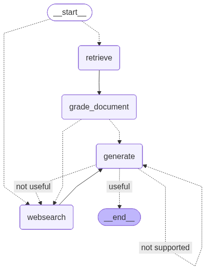

# Corrective RAG (CRAG) with LangGraph

This project implements a **Corrective Retrieval-Augmented Generation (CRAG)** system using **LangGraph**. It is designed to be a self-correcting RAG agent that actively evaluates the quality of retrieved documents and generated answers, actively mitigating hallucinations.



## 🚀 Key Features

*   **Self-Correction**: The agent evaluates retrieved documents for relevance. If documents are irrelevant, it automatically falls back to a web search.
*   **Active Routing**: Routes questions intelligently between vector store retrieval and web search based on the query intent.
*   **Hallucination Grading**: Checks if the generated answer is grounded in the documents and if it actually answers the user's question.
*   **Multilingual Support**: The Streamlit interface supports both **Turkish** and **English**.

## 🛠️ Tech Stack

*   **Orchestration**: LangGraph
*   **LLM**: DeepSeek (via `DeepSeek-V3` / `deepseek-chat`)
*   **Embeddings**: Google Gemini (`models/text-embedding-004`)
*   **Vector Database**: ChromaDB
*   **Web Search**: Tavily Search API
*   **UI**: Streamlit

## 🌐 Live Demo

Verify the application directly on the web:
*[**👉 Click here to use the application**](https://mikail-bitik-correctiveragproject.hf.space)* (If the agent doesn't respond, it could mean that the quota for the LLM being used has been exhausted 🙂)

## ⚙️ Setup & Installation

1.  **Clone the repository:**
    ```bash
    git clone https://github.com/MikailBitik/CorrectiveRAGProject.git
    cd corrective-rag-project
    ```

2.  **Install dependencies:**
    ```bash
    pip install -r requirements.txt
    ```

3.  **Environment Variables:**
    Create a `.env` file in the root directory and add your API keys:
    ```env
    DEEPSEEK_API_KEY=your_deepseek_key
    GOOGLE_API_KEY=your_google_key
    TAVILY_API_KEY=your_tavily_key
    LANGCHAIN_API_KEY=your_langchain_key # Optional: for LangSmith tracing
    LANGCHAIN_TRACING_V2=true           # Optional
    LANGCHAIN_PROJECT=CorrectiveRAGProject # Optional
    ```

## 🏃 Usage

**1. Ingest Data:**
First, crawl and index the knowledge base (default: Lilian Weng's blog posts).
```bash
python ingestion.py
```

**2. Run the Application:**
Start the Streamlit interface.
```bash
streamlit run app.py
```
